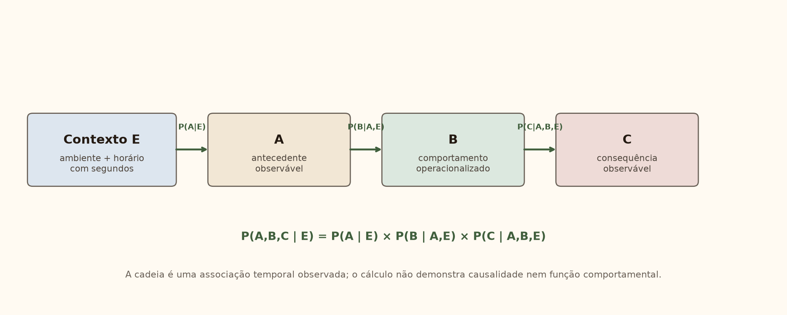
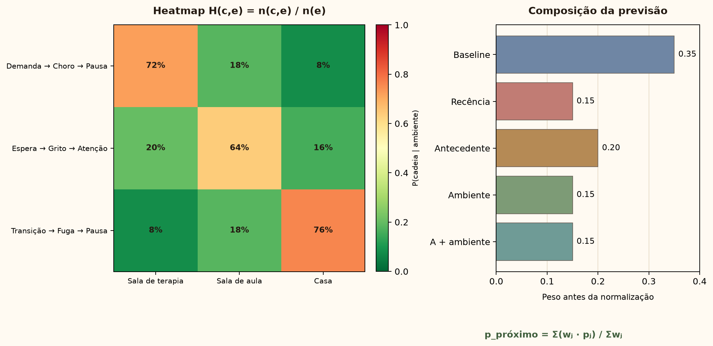
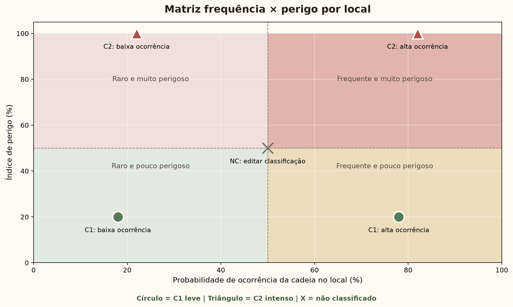

# Sellas Project

Plataforma experimental para **registro, análise e documentação de dados em Análise do Comportamento Aplicada (ABA)**. O Sellas reúne registros ABC, análise de cadeias temporais, relatórios clínicos e módulos de previsão probabilística em uma interface única.

> **Aviso clínico e científico:** as análises do Sellas são ferramentas experimentais de apoio ao analista do comportamento. Elas **não substituem avaliação funcional, julgamento clínico, supervisão profissional ou decisão médica**. Os modelos preditivos ainda **não possuem validação clínica prospectiva** e não devem ser utilizados isoladamente para tomada de decisão clínica. Associações temporais não demonstram causalidade.

## Principais recursos

- registro ABC com data, horário, ambiente, antecedente, comportamento, consequência, intensidade e hipótese funcional;
- classificação de comportamentos interferentes em C1 e C2, com critérios observáveis de risco;
- histórico completo, edição auditável e ordenação pelos registros adicionados mais recentemente;
- análise descritiva de frequências, ambientes, funções e cadeias A-B-C;
- detecção e revisão humana de cadeias temporais entre episódios;
- relatórios clínicos em PDF e Word com estrutura visual consistente;
- exportação do histórico ABC por paciente para Excel;
- avaliações e acompanhamento de habilidades;
- base para integração com bHave;
- experimentos de previsão comportamental com métricas, abstenção e acompanhamento de drift;
- mecanismos de pseudonimização e um checklist de governança e segurança **ainda não auditados para conformidade com a LGPD**.

## O que o projeto procura investigar

O Sellas parte de uma pergunta aplicada: **até que ponto registros comportamentais históricos podem ser organizados para descrever padrões e estimar probabilidades futuras sem transformar correlação em causalidade?**

O projeto separa explicitamente:

1. a cadeia **A-B-C observada no mesmo registro**;
2. relações temporais entre episódios distintos;
3. associações descritivas;
4. estimativas probabilísticas experimentais;
5. interpretação clínica humana.

Consequências posteriores ao comportamento não são utilizadas como se fossem antecedentes do mesmo episódio. Registros ausentes, inválidos ou não observados não são convertidos automaticamente em ausência de comportamento.

## Demonstrações das análises

As figuras abaixo são materiais técnicos do próprio projeto e representam saídas de análise/modelagem utilizadas na documentação metodológica.

### Probabilidade em cadeia ABC



### Heatmap de previsão ABC



### Matriz de risco C1/C2



> O backend também possui um **modo mock totalmente sintético**, com pacientes fictícios `Paciente A` a `Paciente E`, destinado a desenvolvimento, testes e demonstrações sem dados clínicos reais.

## Tecnologias

- **Aplicação clínica:** Python, FastAPI, Streamlit, SQLAlchemy e PostgreSQL/Supabase.
- **Análise e relatórios:** pandas, Plotly, Matplotlib, scikit-learn, SciPy, ReportLab, python-docx e openpyxl.
- **Módulo experimental bHave:** FastAPI, React, TypeScript, Vite e Recharts.
- **Machine Learning:** scikit-learn, validação temporal, feature engineering, métricas, abstenção e monitoramento de drift.
- **Infraestrutura:** Alembic, Docker e Docker Compose.

## Estrutura do projeto

```text
app/                 serviços clínicos, modelos e dashboard Streamlit
backend/             API e módulo experimental de previsão
frontend/            interface React do módulo experimental
alembic/             migrações do banco principal
supabase/            scripts SQL do módulo ABC
tests/               testes automatizados
tools/               geradores e utilitários de documentos
docs/                metodologia, artigos, figuras e documentação técnica
api.py               API clínica FastAPI
main.py              rotinas principais da aplicação
iniciar_sellas.bat   inicializador local para Windows
```

## Pré-requisitos

- Python 3.11 ou superior;
- PostgreSQL ou projeto Supabase;
- Node.js 20 ou superior para o frontend React e utilitários associados;
- Git;
- opcionalmente, Docker Desktop.

## Instalação local

Clone o repositório e entre na pasta:

```bash
git clone https://github.com/gabrielanselmorec-lang/sellas.git
cd sellas
```

Crie e ative um ambiente virtual:

```powershell
python -m venv .venv
.\.venv\Scripts\Activate.ps1
```

Para instalar as versões de referência fixadas:

```powershell
pip install -r requirements.lock.txt
```

Ou, durante desenvolvimento de dependências:

```powershell
pip install -r requirements.txt
```

Copie o arquivo de exemplo e configure somente valores locais:

```powershell
Copy-Item .env.example .env
```

Variáveis essenciais:

- `SELLAS_DATABASE_URL`: conexão PostgreSQL/Supabase;
- `SELLAS_PATIENT_HASH_SALT`: segredo exclusivo para pseudonimização;
- `SELLAS_API_URL`: endereço da API clínica;
- `GEMINI_API_KEY`: opcional, utilizada apenas nos recursos assistidos configurados.

Nunca publique o arquivo `.env`, credenciais, bancos locais ou exportações de pacientes.

## Executando no Windows

Depois de instalar as dependências e configurar o `.env`, execute:

```powershell
.\iniciar_sellas.bat
```

Serviços locais:

- dashboard Streamlit: `http://127.0.0.1:8510`;
- API FastAPI: `http://127.0.0.1:8010`;
- documentação da API: `http://127.0.0.1:8010/docs`.

Também é possível iniciar os serviços separadamente, vinculando-os somente ao computador local:

```powershell
.\.venv\Scripts\python.exe -m uvicorn api:app --host 127.0.0.1 --port 8010
.\.venv\Scripts\python.exe -m streamlit run app\web\dashboard.py --server.address 127.0.0.1 --server.port 8510
```

## Módulo experimental com Docker

O protótipo independente pode ser iniciado com:

```bash
docker compose up --build
```

- frontend React: `http://localhost:5174`;
- API do módulo: `http://localhost:8020`;
- Swagger: `http://localhost:8020/docs`.

O modo mock usa exclusivamente pacientes e registros sintéticos e pode ser habilitado com:

```text
USE_MOCK_DATA=true
```

## Banco de dados

As migrações Alembic ficam em `alembic/versions`. A estrutura complementar do módulo ABC para Supabase está em `supabase/abc_fechado`.

Antes de aplicar migrações em qualquer ambiente com dados reais:

1. faça backup do banco;
2. valide as variáveis do ambiente;
3. aplique primeiro em homologação;
4. confira políticas de acesso e Row Level Security.

## Testes

Execute a suíte completa:

```powershell
pytest
```

Ou somente o módulo experimental:

```powershell
pytest tests\bhave
```

A suíte inclui testes para regras ABC, cadeias temporais, previsão, risco, extração de anotações, geração de relatórios e regras do PEI.

## Segurança, privacidade e governança

O repositório público foi estruturado para não depender de dados clínicos reais, credenciais ou arquivos `.env`. Diretórios de exportação, armazenamento temporário e bancos locais devem permanecer fora do versionamento.

O projeto **inclui mecanismos de pseudonimização, anonimização operacional, auditoria e um checklist de governança**, mas esses mecanismos **não equivalem a uma certificação ou auditoria de conformidade com a LGPD**.

Para qualquer uso institucional ou com dados reais:

- defina base legal e finalidade do tratamento;
- aplique minimização de dados;
- utilize princípio do menor privilégio;
- mantenha segredos fora do código-fonte;
- utilize conexões criptografadas;
- registre acessos e alterações relevantes;
- estabeleça retenção e descarte seguro dos dados;
- avalie políticas de RLS e segregação por usuário/organização;
- submeta o fluxo a revisão clínica, jurídica e de segurança.

## Limitações dos modelos preditivos

Os modelos atualmente presentes no Sellas são **experimentais**. Embora o código implemente recursos como validação temporal, métricas de desempenho, feature importance, abstenção e detecção de drift, isso não demonstra eficácia clínica.

Até o momento, o projeto não apresenta:

- validação clínica prospectiva;
- ensaio controlado demonstrando melhora de desfechos;
- validação externa em múltiplos serviços ou populações;
- calibração aprovada para decisão clínica;
- certificação como software médico ou dispositivo de saúde.

Por isso, uma probabilidade gerada pelo sistema deve ser interpretada como **estimativa exploratória baseada nos dados disponíveis**, nunca como certeza sobre o comportamento futuro de uma pessoa.

## Documentação metodológica

Detalhes adicionais estão em:

- `docs/abc_closed_interval_analysis.md`;
- `docs/abc_temporal_chains.md`;
- `docs/abc_printable_summary.md`;
- `docs/RELATORIO_PREVISAO_ABC_FORMULAS.md`;
- `docs/logica-matematica-previsao-comportamental.md`;
- `docs/previsao-comportamental-bhave-mvp.md`.

## Estado do projeto

O Sellas está em **desenvolvimento ativo e caráter experimental**. Antes de qualquer uso clínico ou institucional, valide localmente a instalação, as migrações, os relatórios, os modelos e as regras de acesso no ambiente de destino.

## Autoria

Projeto desenvolvido como integração entre **Análise do Comportamento, ciência de dados e engenharia de software**, com foco em transformar registros comportamentais em análises descritivas e experimentos probabilísticos auditáveis.
