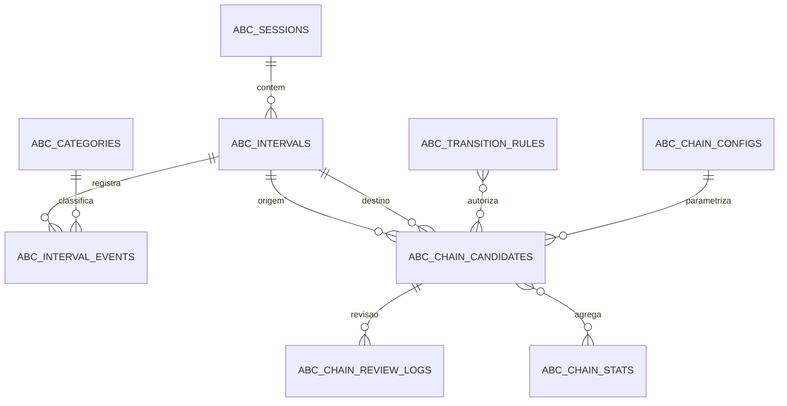

# Cadeias temporais no ABC fechado

## Escopo

Este módulo analisa episódios consecutivos segundo a sequência:

`B_n -> C_n => A_(n+1) -> B_(n+1)`

Ele não substitui a análise A-B-C do mesmo episódio. O resultado é uma hipótese
descritiva temporal e não confirma causa nem função comportamental.

## Critério temporal

1. O tempo de origem é `offset_ts` da consequência; sem esse dado, usa-se o fim do intervalo.
2. O tempo de destino é `onset_ts` do antecedente seguinte; sem esse dado, usa-se o início do intervalo.
3. O elo exige `0 <= delta_seconds <= max_lag_seconds`.
4. Consequência e antecedente do mesmo intervalo são bloqueados.
5. `not_observed` e `invalid` não são negativos; podem censurar e interromper a busca.
6. Sessões diferentes são bloqueadas por padrão.
7. Códigos diferentes exigem regra ativa e versionada em `abc_transition_rules`.

O formulário atual grava o horário completo digitado em `onset_ts` e `offset_ts`
dos três eventos selecionados. Para registros anteriores à migração, o início do
intervalo é usado como aproximação e essa limitação deve acompanhar a leitura.

## Configuração versionada

A tabela `abc_chain_configs` contém os parâmetros ativos. A versão inicial usa:

| Campo | Valor inicial | Uso |
|---|---:|---|
| `interval_minutes` | 5 | tamanho planejado do intervalo |
| `max_lag_seconds` | 300 | defasagem máxima intrabloco |
| `min_confidence` | 0,90 | confiança mínima composta |
| `require_observed_end` | `true` | exige encerramento observável |
| `allow_cross_session_chain` | `false` | bloqueia sessões clínicas distintas |
| `include_same_interval_transition` | `false` | impede vazamento do próprio episódio |
| `break_on_not_observed` | `true` | lacuna censura o elo |
| `minimum_valid_intervals` | 20 | amostra mínima para evidência não insuficiente |
| `chain_min_repetitions` | 3 | repetição mínima |
| `use_transition_ontology` | `true` | habilita regras mapeadas |
| `legacy_contiguous_sessions` | `true` | identifica cliques legados contínuos, sem declará-los mesma sessão clínica |

## Dicionário de dados

### `abc_transition_rules`

- `from_consequence_code`, `to_antecedent_code`: par permitido.
- `relation_type`: `exact`, `mapped` ou `clinical_review`.
- `rule_version`, `active`, `rationale`: versão, vigência e justificativa.

### `abc_chain_candidates`

- Liga intervalos e eventos de origem e destino por UUID.
- Guarda os quatro códigos da cadeia, tempos, `delta_seconds`, confiança e ambiente.
- `session_relation` distingue `same_session`, `legacy_contiguous` e `cross_session_allowed`.
- `validation_status`: `candidate`, `accepted`, `rejected` ou `censored`.
- `reviewed_by`, `reviewed_at`, `review_note`: revisão humana versionada no tempo.

### `abc_chain_stats`

Uma linha por consequência anterior, antecedente seguinte e comportamento seguinte.
Guarda exposição, transição, probabilidade, diferença de risco, lift, OR, RR, phi,
intervalo de confiança, Fisher e estabilidade.

### `abc_chain_review_logs`

Trilha imutável de transição de status, responsável, data e justificativa.

## Diagrama ER



## Fórmulas

Para `C -> A -> B`:

- `P(A_next | C_prev) = n(C -> A) / n(C)`.
- `P(B_next | C_prev, A_next) = n(C -> A -> B) / n(C -> A)`.
- `difference_in_risk = P(B | cadeia) - P(B)`.
- `lift = P(B | cadeia) / P(B)`.
- `OR = ad / bc`.
- `RR = [a/(a+b)] / [c/(c+d)]`.
- `phi = (ad-bc) / sqrt((a+b)(c+d)(a+c)(b+d))`.

O intervalo da probabilidade usa Wilson. Tabelas 2x2 com célula zero recebem
0,5 em todas as células para OR, RR e respectivos intervalos logarítmicos. O
p-valor de Fisher é bilateral e exato. A estabilidade combina repetição,
cobertura de sessões e cobertura de meses/períodos. Resultados com base pequena
permanecem marcados como `insufficient`.

## API

| Método | Endpoint | Função |
|---|---|---|
| `POST` | `/api/abc/chains/detect` | detecta, valida e persiste candidatos e estatísticas |
| `POST` | `/api/abc/chains/approve-current` | cria regras ausentes e aceita candidatos atuais após confirmação explícita |
| `GET` | `/api/abc/chains/candidates` | lista candidatos por paciente e status |
| `GET` | `/api/abc/chains/{id}` | detalha um candidato |
| `POST` | `/api/abc/chains/{id}/review` | aceita ou rejeita com auditoria |
| `GET` | `/api/abc/chains/stats` | retorna métricas por cadeia |
| `GET` | `/api/abc/chains/transition-matrix` | matriz consequência para antecedente |
| `GET` | `/api/abc/chains/timeline` | episódios ordenados no tempo |
| `GET` | `/api/abc/config/chain-rules` | configuração ativa e regras |
| `POST` | `/api/abc/config/chain-rules` | cria ou atualiza regra versionada |
| `GET` | `/api/ml/features/chains` | features encerradas antes do landmark |

Exemplo de detecção:

```json
{
  "paciente": "PACIENTE TESTE",
  "max_lag_seconds": 300,
  "min_confidence": 0.9,
  "allow_cross_session_chain": false,
  "chain_min_repetitions": 3
}
```

Exemplo de revisão:

```json
{
  "status": "accepted",
  "revisado_por": "Analista responsável",
  "observacao": "Elo temporal confirmado no registro e compatível com a regra versionada."
}
```

## Proteção contra vazamento

`GET /api/ml/features/chains` só considera candidatos `accepted` quando:

- `completed_at <= landmark_ts`;
- `created_at <= landmark_ts`;
- `reviewed_at <= landmark_ts`.

Candidatos pendentes, revisão posterior, eventos retroeditados após o landmark e
consequências do episódio-alvo são excluídos. As features disponíveis são
contagens recentes, taxa em sete dias, última defasagem, tipo, lift, estabilidade,
tempo desde a última cadeia e contagem no mesmo contexto.

## Model card

**Finalidade:** apoiar exploração de sequências temporais em registros ABC fechados.

**População:** apenas pacientes com observação estruturada, timestamp completo e
categorias versionadas. Não há validação externa para generalização clínica.

**Saída:** associação temporal pessoal, com qualidade e incerteza. Não é diagnóstico,
recomendação de intervenção ou avaliação funcional concluída.

**Riscos:** erro de timestamp, cobertura desigual, regras ontológicas inadequadas,
dependência entre observações, poucos episódios, retroedição e interpretação causal.

**Controles:** revisão humana, trilha de auditoria, bloqueio entre sessões, lacunas
censuradas, configuração versionada, alerta não causal e anti-vazamento por landmark.

**Uso proibido:** punição, restrição automática, decisão clínica autônoma, inferência
de intenção ou função confirmada e treinamento com informação posterior ao alvo.

## Limitações

- Registros antigos não têm duração real do evento; usam o início do intervalo.
- A continuidade legada serve apenas para cliques do mesmo dia e ambiente, dentro do
  lag. O campo `session_relation` mantém essa origem visível.
- Fisher, OR e RR não corrigem viés de observação ou dependência serial.
- Estabilidade não substitui replicação planejada entre observadores e condições.
- Antes de uso real, são obrigatórias revisão LGPD, governança clínica e avaliação regulatória.
- Aprovação em lote só deve ser usada após confirmação explícita; falhas temporais,
  baixa confiança e lacunas de observação continuam bloqueadas.

## Operação

Use `alembic upgrade head` em instalações geridas por Alembic. No Supabase, execute
`supabase/abc_fechado/005_create_temporal_chains.sql`. O serviço também possui
inicialização idempotente para instalações já existentes.
